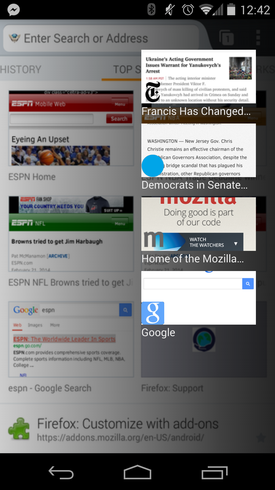

Fennec New Tab Experimentation
==============================

An experimental tab switching interface for Firefox on Android

## Goals of the new interface
- Switching between tabs should be faster
- Tab switching should feel seamless and less effortful to do.
- A consistent mental model for users understanding tab behaviour.

## Current Interface

- [New tab](img/screenshots/new.tab.png)
- [Tab drawer](img/screenshots/tab.drawer.open.png)
- [New tab (private browsing)](img/screenshots/new.tab.private.browsing.png)
- [Tab drawer (private browsing)](img/screenshots/tab.drawer.open.private.browsing.png)

## Experimental Interface

A major feature of this interface is being able to tab and hold on the tab button
and swipe your finger to "hover" over each tab interface. This hovering allows
the user to quickly switch between recent tabs in one motion. In addition, tabs
can be previewed quickly.

Note: the screenshot presented is not a final designed version, only a rough draft.
